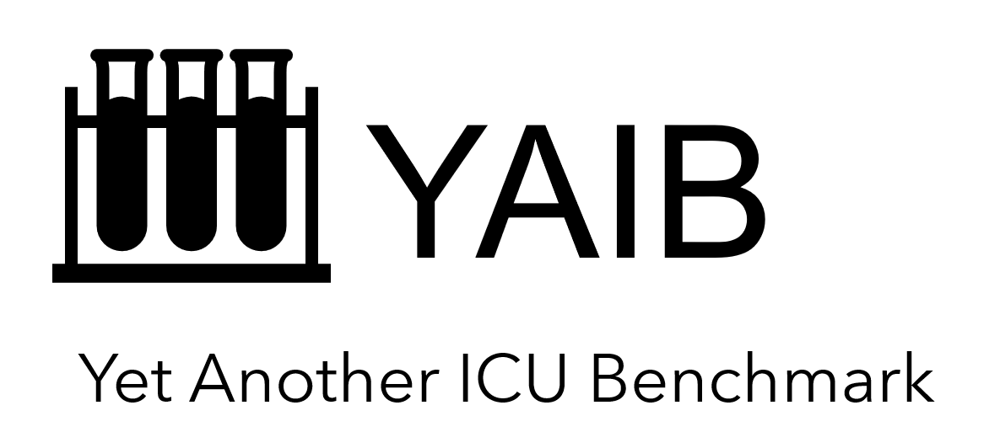
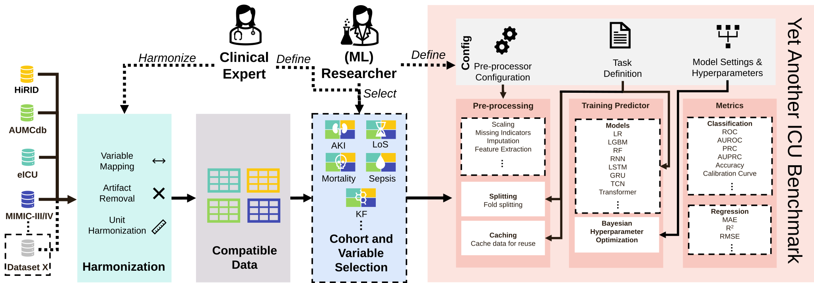
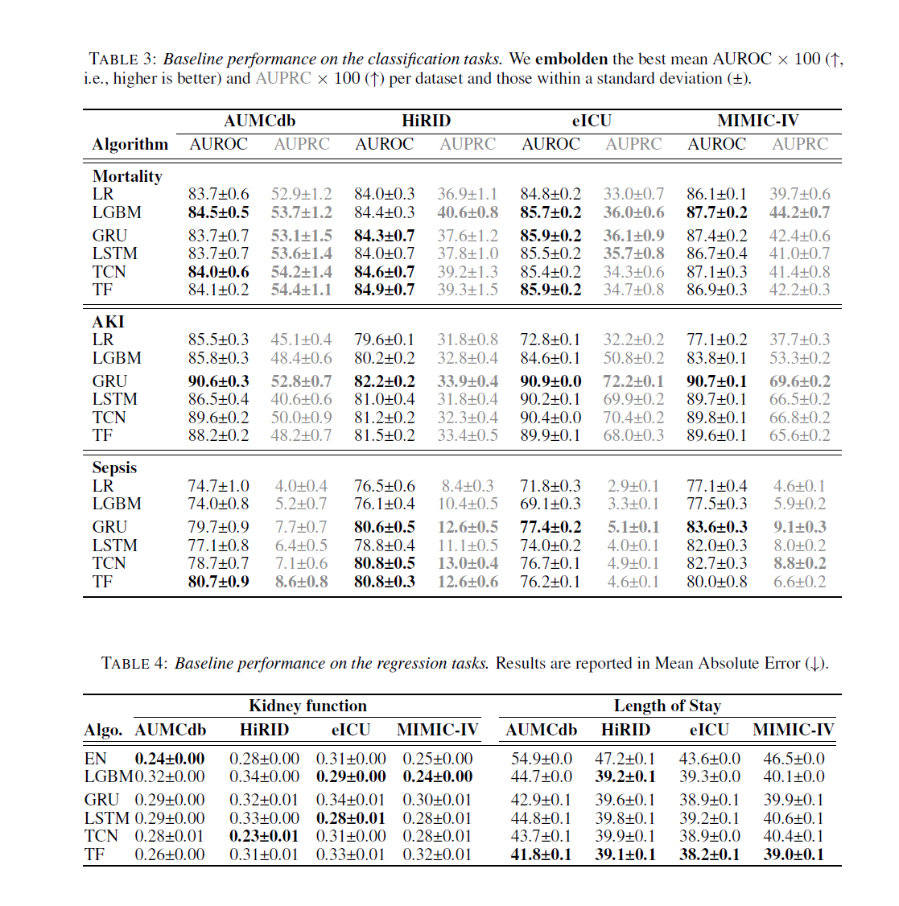

> 📋 This file follows the template for releasing ML research code
> from [papers with code](https://github.com/paperswithcode/releasing-research-code)



# Yet Another ICU Benchmark: _A Flexible Multi-Center Framework for Clinical ML_

This repository is the official implementation of [Yet Another ICU Benchmark: A Flexible Multi-Center Framework for Clinical ML](https://arxiv.org/abs/2306.05109).
See a graphical overview of our framework below:


Yet Another ICU Benchmark was designed to address reproducibility issues and provide a unified interface to develop clinical prediction models for the ICU. An experiment in YAIB consists of four steps:

1. Defining clinical concepts from the raw data.
2. Extracting the patient cohort and specifying the prediction task.
3. Preprocessing and feature generation.
4. Training and evaluation of the ML model.

## 📋 Requirements

YAIB is installed from source using `uv` and the repository's `pyproject.toml`.

Install `uv` if needed:

```bash
curl -LsSf https://astral.sh/uv/install.sh | sh
```

Then install Python 3.10, pin it for the repository, and sync the environment:

```bash
uv python install 3.10
uv python pin 3.10
uv sync
```

To install development dependencies as well:

```bash
uv sync --dev
```

Check that the CLI is available:

```bash
uv run icu-benchmarks train -h
```

To get the datasets for this paper, please see the [YAIB-cohorts repository](https://github.com/rvandewater/YAIB-cohorts) and the [page on the YAIB wiki](https://github.com/rvandewater/YAIB/wiki/Generating-Cohorts). You will need to get access to the ICU datasets that you want to run by following the relevant credentialing procedure.

## Training

The easiest method to train the models in the paper is to run these commands from the directory root:

```bash
uv run wandb sweep --verbose experiments/benchmark_classification.yml
uv run wandb sweep --verbose experiments/benchmark_regression.yml
```

This will create two hyperparameter sweeps for Weights & Biases for the classification and regression tasks. You can then run the following command to train the models:

```bash
uv run wandb agent <sweep_id>
```

> Tip: You can choose to run each of the configurations on a SLURM cluster instance with `uv run wandb agent --count 1 <sweep_id>`.

### Quickstart

The authors of MIMIC-III and eICU have made small demo datasets available to demonstrate their use. They can be found on PhysioNet: [MIMIC-III Clinical Database Demo](https://physionet.org/content/mimiciii-demo/1.4/) and [eICU Collaborative Research Database Demo](https://physionet.org/content/eicu-crd-demo/2.0.1/). These datasets are published under the [Open Data Commons Open Database License v1.0](https://opendatacommons.org/licenses/odbl/1-0/) and can be used without a credentialing procedure. We have created demo cohorts that are processed **solely from these datasets** for each of our currently supported task endpoints. To the best of our knowledge, this is in compliance with the license and the respective dataset authors' instructions. Usage of the task cohorts and dataset is only permitted in accordance with the above license.

We **strongly recommend** completing human subject research training to ensure you properly handle human subject research data.

You can run the following command to train a model on the included demo cohort:

```bash
uv run icu-benchmarks train \
    -d demo_data/mortality24/mimic_demo \
    -n mimic_demo \
    -t BinaryClassification \
    -tn Mortality24 \
    -m XGBClassifier \
    --seed 2222 \
    -l ../yaib_logs/ \
    --tune
```

Alternatively, to reproduce the full demo sweeps:

```bash
uv run wandb sweep --verbose experiments/demo_benchmark_classification.yml
uv run wandb sweep --verbose experiments/demo_benchmark_regression.yml
```

Use the command above to create a sweep and then run it with `uv run wandb agent <sweep_id>`.

## Evaluation

Evaluation happens automatically after training. Additionally, YAIB will generate log files and model files. The logging location is specified within the `.yml` files. We recommend using the Weights & Biases web interface to inspect the results.

## Pre-trained Models

You can download pretrained models here: [YAIB-models GitHub repository](https://github.com/rvandewater/YAIB-models).
YAIB has built-in functionality to evaluate these models. See the command below for an example:

```bash
uv run icu-benchmarks evaluate \
    -d demo_data/mortality24/eicu_demo \
    -n eicu_demo \
    -t BinaryClassification \
    -tn Mortality24 \
    -m LGBMClassifier \
    --generate_cache \
    --load_cache \
    -s 2222 \
    -l ../yaib_logs \
    -sn mimic \
    --source-dir ../yaib_logs/mimic_demo/Mortality24/LGBMClassifier/2022-12-12T15-24-46/fold_0
```

## 📊 Results

The current latest results are shown below. Note that there have been major changes between the classification and regression task experiments. However, results should be comparable overall. Updated results will be posted in the near future.


## Contributing

This source code is released under the MIT license, included [here](LICENSE). We do not own any of the datasets used or included in this repository. The demo datasets have been released under an [Open Data Commons Open Database License (ODbL)](https://opendatacommons.org/licenses/odbl/1-0/).
